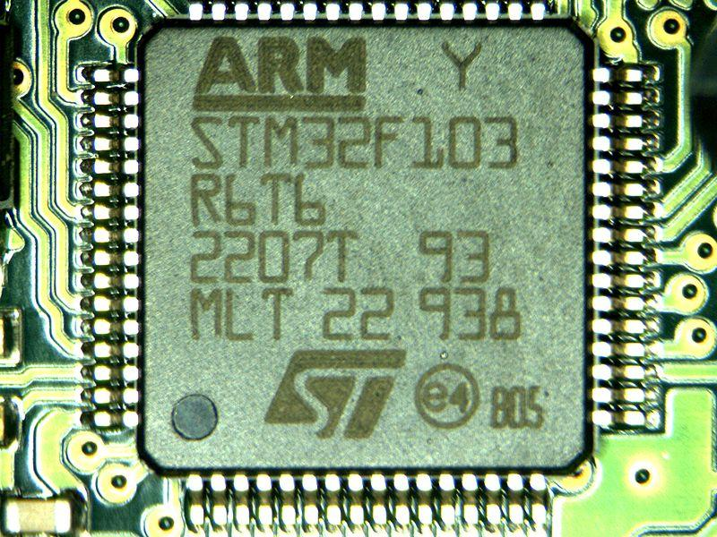

# NTI Intensive Training Round-4 ARM Course

Welcome to this repository!

Here you will find all the files related to the ARM STM32F10x Microcontroller course given by the NTI
You will find here the driver implementations, app coding, tasks, and projects.

  

## Author: Hossam Mahmoud
